# Database and SQL

# Plan

```mermaid
graph TD
    db[Data base theory 'PostgreSQL'];
    db --> indexes[Indexes];
    db --> acid[ACID];
    db --> oltp_vs_olap[Oltp vs olap];
    db --> optimization[Optimization];
%%%%%
    optimization --> normalization_and_denormalization[Normalization and denormalization];
    optimization --> vaccum[Vaccum];
    optimization --> analyze_and_profiling[Analyze and Profiling];
%%%%%
    acid --> mvcc[MVCC];
%%%%%
    indexes --> btree[Btree index];
    indexes --> hash[Hash index];
    indexes --> brin[Brin index];
    indexes --> Constrains[Constrains];
%%%%%
    btree --> partial_indexes[Partial Index];
    btree --> multicolumn_indexes[Multicolumn Indexes];
%%%%%
    sql[SQL];
%%%%%
    sql --> ddl[DDL];
    ddl --> relations[Relations];
    ddl --> data_types[Data types];
    ddl --> managing_tables[Managing tables];
%%%%%
    sql --> dml[DML];
    dml --> join[Join];
    dml --> crud[CRUD];
    dml --> subquery[Subquery];
    dml --> querying_and_filtering[Querying and filtering data];
    dml --> group_data[Group data];
%%%%%
    sql --> tcl[TCL];
    tcl --> transaction_and_blocking[Transaction and Blocking];
%%%%%
    sql --> sqlalchemy[Sqlalchemy];
    sqlalchemy --> migration_system[Migration system];
    sqlalchemy --> sql_into_sqlalchemy[Sql into sqlalchemy];
```

# Priority

1. indexes
    1. btree
        1. multicolumn
        2. partial
    2. Hash index
    3. Brin index
    4. Constrains
2. Analyze and Profiling
3. join
4. relations
5. Transaction and Blocking
6. Normalization and denormalization
7. ACID
8. MVCC
9. Vaccum

